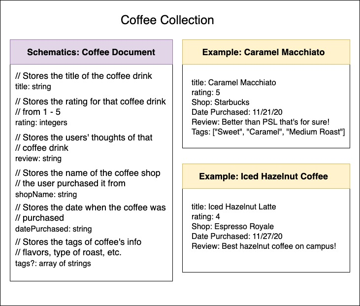
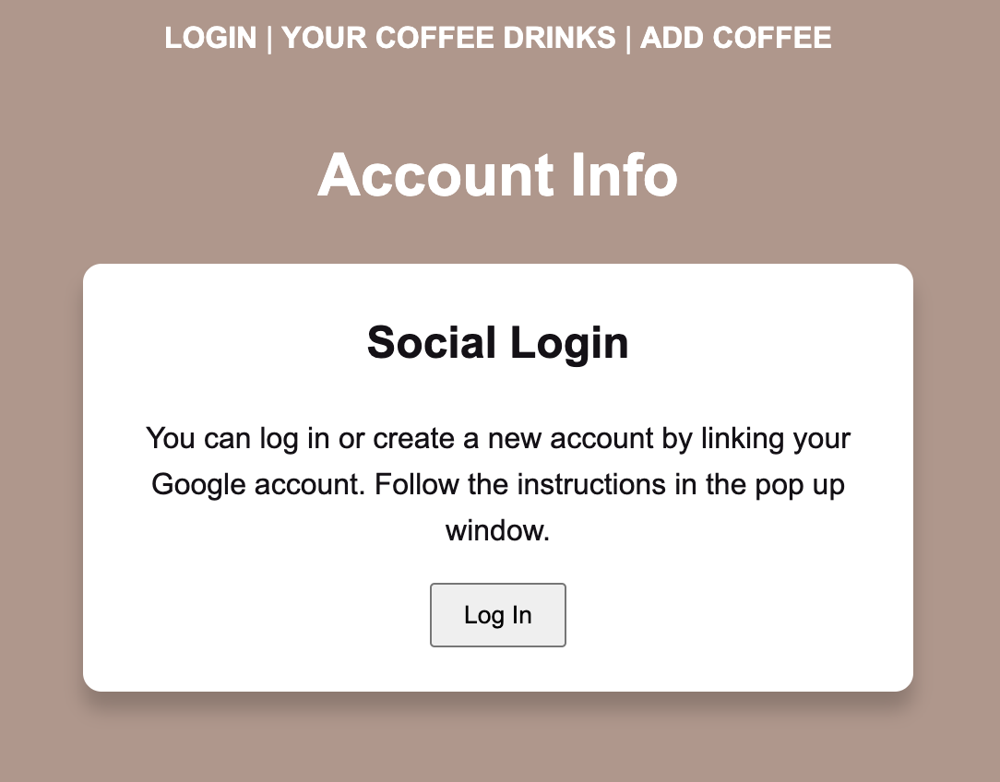
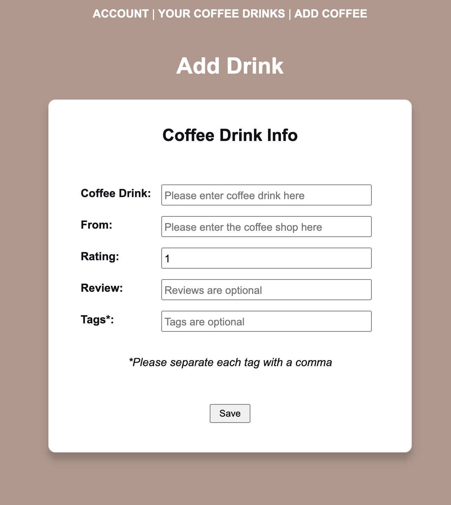
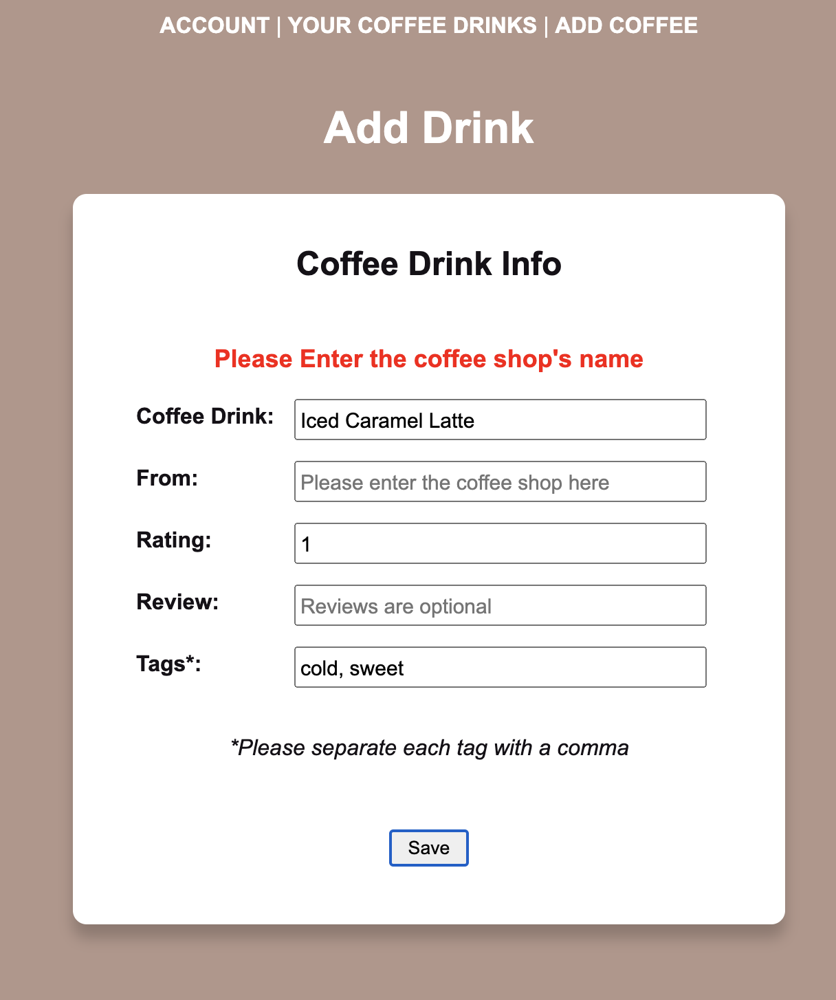
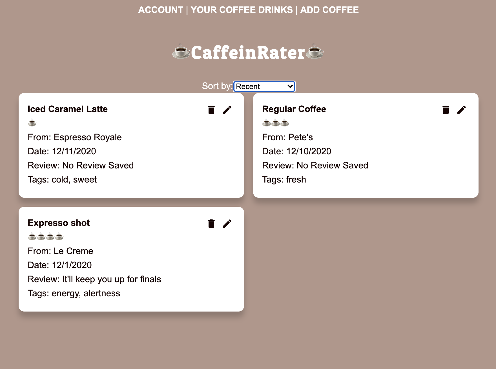
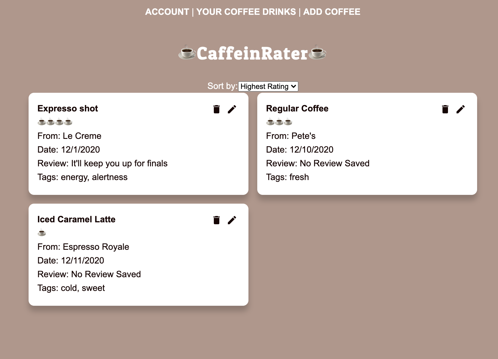

# CaffeinRater App

This web application will let the participant to enter their recent coffee drink they've ordered. This acts as a mini coffee journal that the participant can go back and see where and when they ordered their previous coffee orders. This is done after they had their coffee so they can refer back to that data later on. The "Sort By" feature for this

> This is the schematics for this project planning from Code Sprints B.

## How It Works

The first screen is where the participant can view all of their drinks they've entered.

> Account Login Screen

This is the landing screen. Here you will see the Log In button, however, if you're a new user you will see Sign In button. A pop up screen will appear for you to enter in your email.

> Add Coffee Screen

In "Add Coffee," in the navigation bar above, is where the user can add their coffee drinks in a form. Once they entered, they will see "Save Successfully" appear upon submitting the coffee drink.

> Validation Error Screen

An error will appear if the Coffee Drink and the Coffee Shop are not entered. Those fields are required. Rating is set to 1 by default. Review and Tags are optional. Once that is completed, the user will view their drink(s) in the "View Your Coffee Drinks" page link.

> Sorting by Recent Feature

By default the user will see their most recent entries made on this listing.

> Sorting by Highest Rating Feature

This is the Highest Rating sorting option. Here, the user's ratings are sorted from their highest to lowest ratings.

## Current Status :white_check_mark:

This is what is built so far. (important & new parts)

- [x] CRUD functionality
- [x] 3 unique data types
- [x] firebase collection connected
- [x] .env.local file running smoothly
- [x] project is saved in vercel and settings are all updated with the firebase credentials for the environmental variables.
- [x] Account page
- [x] One custom hook
- [x] userID configuration with firestore

### Other Notes

> This app is a final project for my Code Sprints C class. This course was solely focused on the server back-end programming. This is a continuation from my previous project from Code Sprints B.
